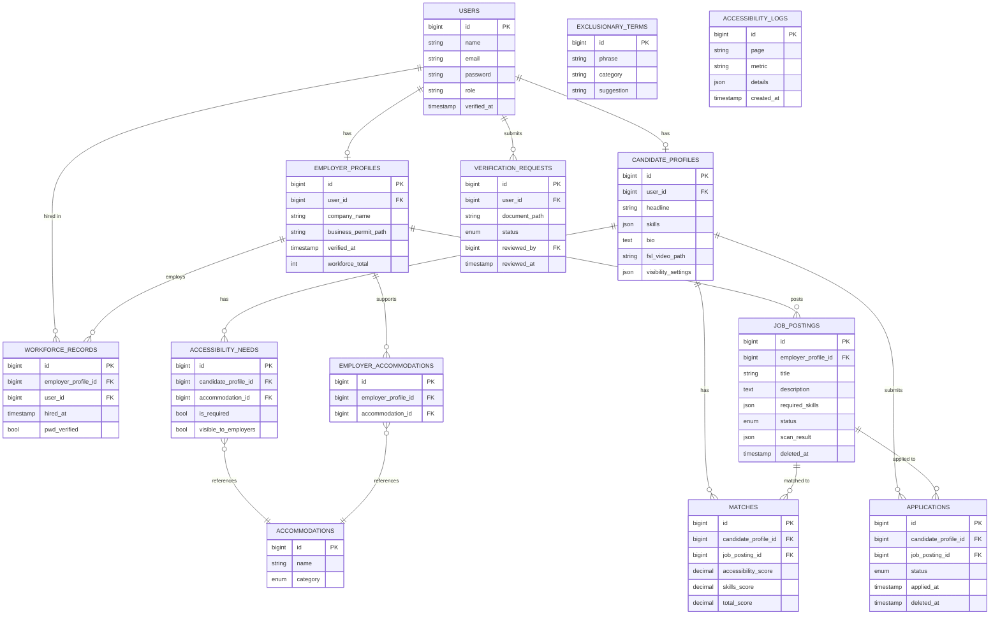

# ERD — PWD-E

```mermaid
erDiagram
    USERS ||--o| CANDIDATE_PROFILES : "has"
    USERS ||--o| EMPLOYER_PROFILES : "has"
    USERS ||--o{ VERIFICATION_REQUESTS : "submits"
    USERS ||--o{ WORKFORCE_RECORDS : "hired in"

    CANDIDATE_PROFILES ||--o{ ACCESSIBILITY_NEEDS : "has"
    ACCESSIBILITY_NEEDS }o--|| ACCOMMODATIONS : "references"
    CANDIDATE_PROFILES ||--o{ MATCHES : "has"
    CANDIDATE_PROFILES ||--o{ APPLICATIONS : "submits"

    EMPLOYER_PROFILES ||--o{ JOB_POSTINGS : "posts"
    EMPLOYER_PROFILES ||--o{ EMPLOYER_ACCOMMODATIONS : "supports"
    EMPLOYER_ACCOMMODATIONS }o--|| ACCOMMODATIONS : "references"
    EMPLOYER_PROFILES ||--o{ WORKFORCE_RECORDS : "employs"

    JOB_POSTINGS ||--o{ MATCHES : "matched to"
    JOB_POSTINGS ||--o{ APPLICATIONS : "applied to"

    USERS {
        bigint id PK
        string name
        string email
        string password
        string role
        timestamp verified_at
    }
    CANDIDATE_PROFILES {
        bigint id PK
        bigint user_id FK
        string headline
        json skills
        text bio
        string fsl_video_path
        json visibility_settings
    }
    EMPLOYER_PROFILES {
        bigint id PK
        bigint user_id FK
        string company_name
        string business_permit_path
        timestamp verified_at
        int workforce_total
    }
    ACCOMMODATIONS {
        bigint id PK
        string name
        enum category
    }
    ACCESSIBILITY_NEEDS {
        bigint id PK
        bigint candidate_profile_id FK
        bigint accommodation_id FK
        bool is_required
        bool visible_to_employers
    }
    EMPLOYER_ACCOMMODATIONS {
        bigint id PK
        bigint employer_profile_id FK
        bigint accommodation_id FK
    }
    JOB_POSTINGS {
        bigint id PK
        bigint employer_profile_id FK
        string title
        text description
        json required_skills
        enum status
        json scan_result
        timestamp deleted_at
    }
    MATCHES {
        bigint id PK
        bigint candidate_profile_id FK
        bigint job_posting_id FK
        decimal accessibility_score
        decimal skills_score
        decimal total_score
    }
    APPLICATIONS {
        bigint id PK
        bigint candidate_profile_id FK
        bigint job_posting_id FK
        enum status
        timestamp applied_at
        timestamp deleted_at
    }
    WORKFORCE_RECORDS {
        bigint id PK
        bigint employer_profile_id FK
        bigint user_id FK
        timestamp hired_at
        bool pwd_verified
    }
    VERIFICATION_REQUESTS {
        bigint id PK
        bigint user_id FK
        string document_path
        enum status
        bigint reviewed_by FK
        timestamp reviewed_at
    }
    EXCLUSIONARY_TERMS {
        bigint id PK
        string phrase
        string category
        string suggestion
    }
    ACCESSIBILITY_LOGS {
        bigint id PK
        string page
        string metric
        json details
        timestamp created_at
    }
```